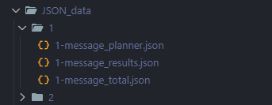

# Plan自动化生成器
> 用于LLM Plan的自动化测试

## 使用
1. 克隆项目
   ```
   git clone https://github.com/KeLes-Coding/PlanGeneration.git
   ```
2. 安装依赖
   ```
   pip install -r requirements.txt
   ```
3. 运行
   
   在 `windows` 终端中运行
   ```
   python run.py
   ```
4. 设置变量
   * 在`config`中，设置参数:
     * `MESSAGE_PATH`: 存放`query`的文件路径
       * 注意message存放方式:`{Message_Number:Query}`
     * `JSON_DATA`:`JSON`文件保存地址
     * `MESSAGE_PLANNER`:保存`tools`参数
     * `MESSAGE_RESULT`:保存`tools`返回值
   * 在`message.txt`中设置`query`
5. 运行结果
   
   `JSON`文件默认保存在`JSON_DATA`中:
   
   
      1. `{Message_Number}-Message-planner.json`
      2. `{Message_Number}-Message-results.json`
      3. `{Message_Number}-Message-total.json`